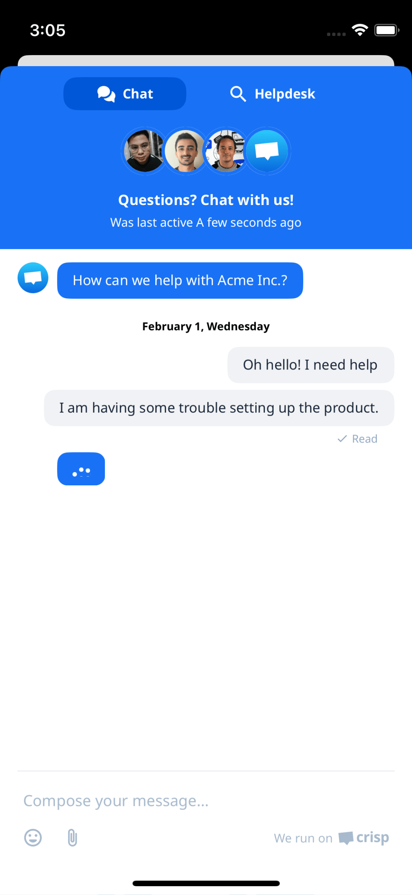
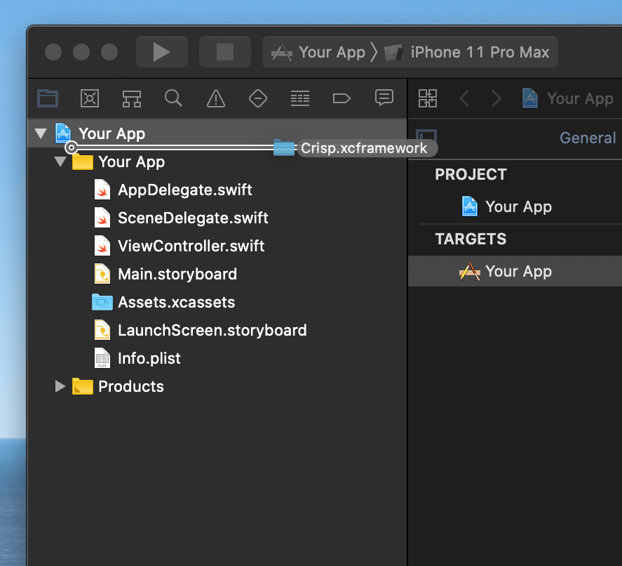
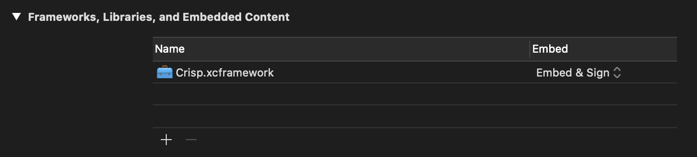
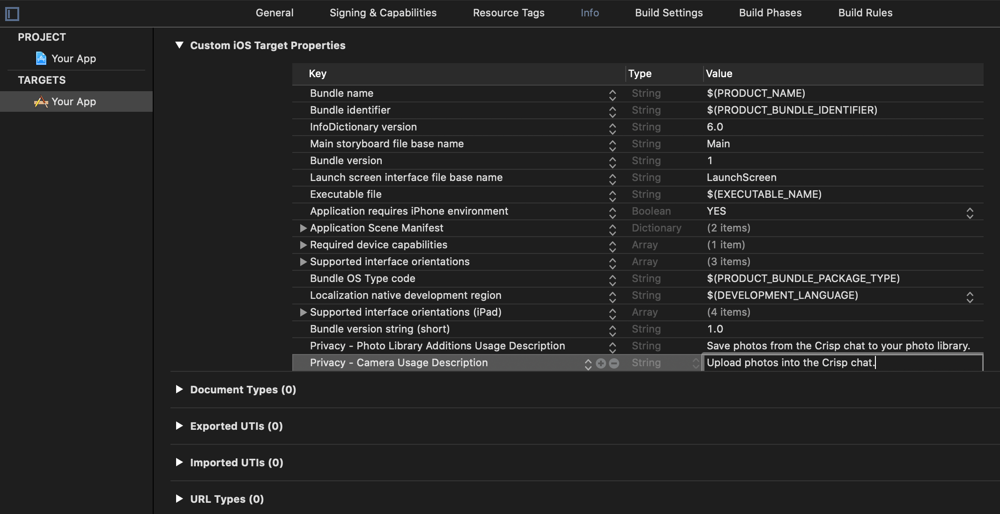
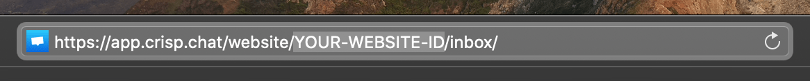
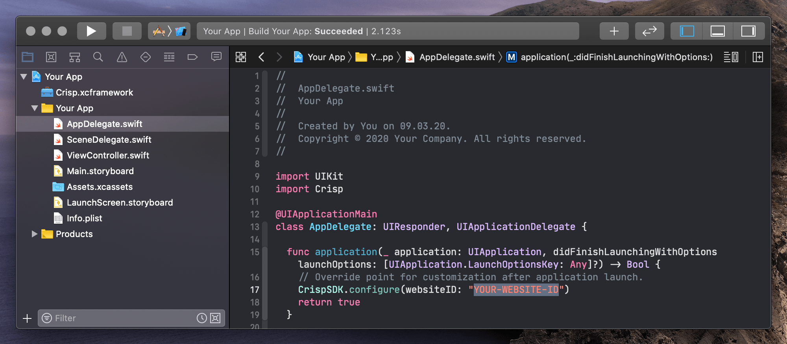
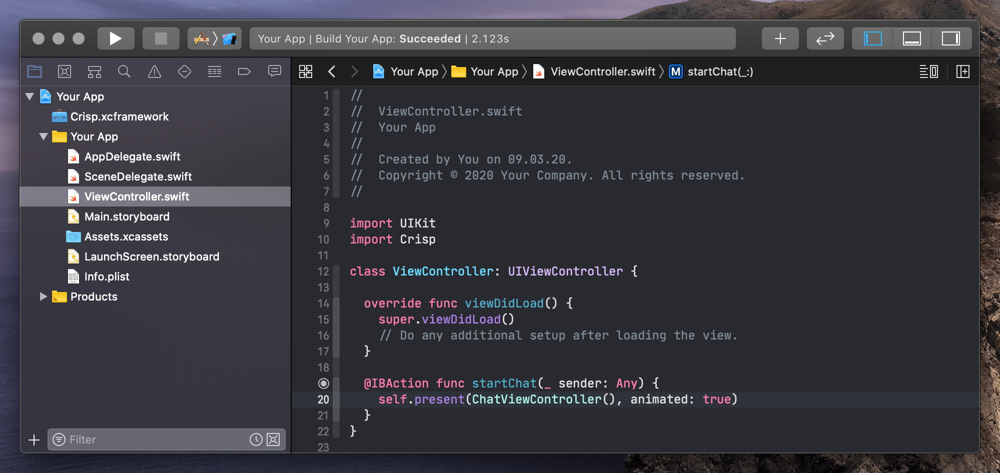

Chat with app users, integrate your favorite tools, and deliver a great customer experience.

# Crisp iOS SDK



[](https://cocoapods.org/?q=crisp)
[](http://twitter.com/crisp_im)

## How to use

### 1. Install Crisp iOS SDK

#### Option 1: Using [CocoaPods](http://cocoapods.org)

Add Crisp to your Podfile:

```ruby
use_frameworks!

target :YourTargetName do
  pod 'Crisp'
end
```

Then run  `pod install`

#### Option 2: Manual installation

1. Download and extract the [Crisp iOS SDK](https://github.com/crisp-im/crisp-sdk-ios/releases).
2. Drag the `Crisp.xcframework` into your project, select `Copy items if needed` in the following dialog and click `Finish`.




3. Finally, configure the `Crisp.xcframework` to `Embed & Sign` in the `Frameworks, Libraries, and Embedded Content` section of your app's target settings.



### 2. Update your Info.plist

To enable your users to take and upload photos to the chat as well as download photos to their photo library, add the 
`Privacy - Camera Usage Description` ([NSCameraUsageDescription](https://developer.apple.com/documentation/bundleresources/information_property_list/nscamerausagedescription)) and `Privacy - Photo Library Additions Usage Description` ([NSPhotoLibraryAddUsageDescription](https://developer.apple.com/documentation/bundleresources/information_property_list/nsphotolibraryaddusagedescription)) to your app's Info.plist.



### 3. Configure the Crisp iOS SDK

Go to your Crisp dashboard (https://app.crisp.chat), copy your website id from the resulting URL and configure the `CrispSDK` in your app's `AppDelegate`.





### 4. Present the `ChatViewController`



## Credits

Crisp iOS SDk is owned and maintained by [Crisp IM, SARL](https://crisp.chat/en/). You can chat with us on [crisp](https://crisp.chat) or follow us on Twitter at [Crisp_im](http://twitter.com/crisp_im)

## License

Crisp iOS SDk is under Copyright license. see [LICENSE](https://raw.githubusercontent.com/crisp-im/crisp-sdk-ios/master/LICENSE) for more details.
