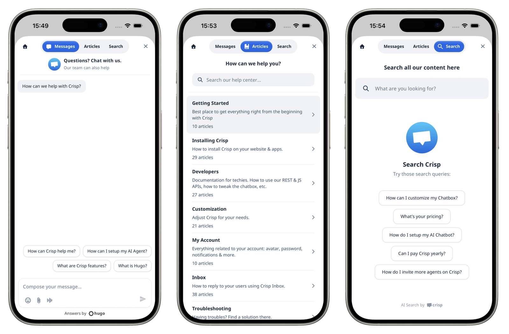

<p align="center">
  
</p>

Chat with app users, integrate your favorite tools, and deliver a great customer experience.

# Crisp iOS SDK



[](https://cocoapods.org/?q=crisp)
[](http://twitter.com/crisp_im)

## Installation

### Swift Package Manager

In Xcode, choose **File → Add Package Dependencies…**, enter the package URL below, and select a version rule (e.g. _Up to Next Major Version_ starting from `3.0.0`):

```
https://github.com/crisp-im/crisp-sdk-ios
```

Or add it to your `Package.swift`:

```swift
dependencies: [
  .package(url: "https://github.com/crisp-im/crisp-sdk-ios", .upToNextMajor(from: "3.0.0")),
],
```

## Quick Start

Configure the SDK once at launch with your Website ID, then present the chatbox. In SwiftUI use `ChatView` (for UIKit, use `ChatViewController`):

```swift
import Crisp
import SwiftUI

@main
struct MyApp: App {
  init() {
    CrispSDK.configure(websiteID: "YOUR_WEBSITE_ID")
  }

  var body: some Scene {
    WindowGroup {
      ContentView()
    }
  }
}

struct ContentView: View {
  @State var isChatPresented = false

  var body: some View {
    Button("Show chat") {
      self.isChatPresented = true
    }
    .sheet(isPresented: self.$isChatPresented) {
      ChatView()
    }
    .padding()
  }
}
```

## Documentation

- [DocC reference documentation](https://crisp-im.github.io/crisp-sdk-ios/documentation/crisp/)
- [Crisp Developer Hub — iOS SDK guide](https://docs.crisp.chat/guides/chatbox-sdks/ios-sdk/)

## Credits

Crisp iOS SDK is owned and maintained by [Crisp IM SAS](https://crisp.chat/en/). You can chat with us on [crisp](https://crisp.chat) or follow us on Twitter at [Crisp_im](http://twitter.com/crisp_im)

## License

Crisp iOS SDK is under Copyright license. see [LICENSE](https://raw.githubusercontent.com/crisp-im/crisp-sdk-ios/master/LICENSE) for more details.
